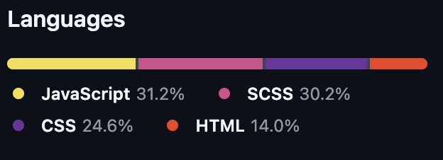
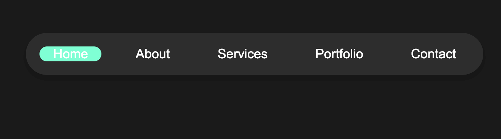
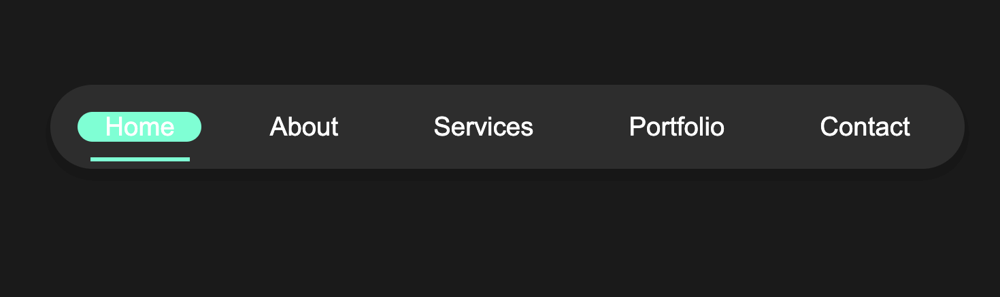

# Magic-Navbar-Menu
This project shows an example navigation bar. On hover the green highlight moves to the highlighted item, and a green line which matched the hover colour appears underneath too.

## Languages used:

## Showcase:
#### Notmal State

#### On Hover

To view and test the live example please click (here)[https://andrewh1188.github.io/Magic-Navbar-Menu/]